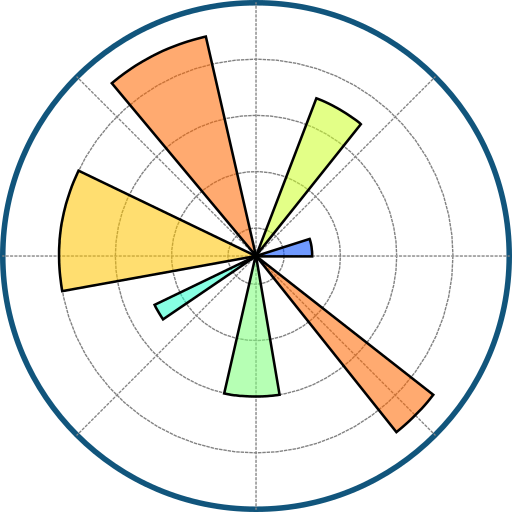

MY PORTFOLIO
<h1 align="center">Hi 👋, I'm Shaktiman Gupta</h1>
<h3 align="center">A passionate Data Analyst from India</h3>

 
   

- 🌱 I’m currently learning *Data Analytics*

- 👨‍💻 Watch my LinkedIn profile: [https://www.linkedin.com/in/its-shaktiman-gupta/](https://www.linkedin.com/in/its-shaktiman-gupta/)

- 📫 How to reach me: *its.shaktiman.gupta@gmail.com*
 
<h3 align="left">Connect with me:</h3>

  
 
  

 
<h3 align="left">LANGUAGES AND TOOLS:</h3>

  
  
  
   
  
  
  
  
  

 
<h3 align="left">📊 MY PROJECTS (15+) </h3>

<table>
  <tr>
    <td align="center" width="300">
      <a href="https://github.com/ShaktimanGupta/DATA-SCIENCE-JOBS-IN-INDIA-ANALYSIS-EXCEL-PROJECT" target="_blank">
        
         <b>📁 DATA SCIENCE JOB MARKET ANALYSIS [EXCEL PROJECT]</b>
      </a>
    </td>
    <td align="center" width="300">
      <a href="https://github.com/ShaktimanGupta/LIBRARY_MANAGEMENT_GOOGLE_SHEETS_PROJECT" target="_blank">
        
         <b>📁 LIBRARY MANAGEMENT [GOOGLE SHEETS PROJECT] </b>
      </a>
    </td>
    <td align="center" width="300">
      <a href="https://github.com/ShaktimanGupta/MOBILE-SALES-DASHBOARD-USING-POWER-BI" target="_blank">
        
         <b>📁 MOBILE SALES ANALYSIS [POWER BI PROJECT] </b>
      </a>
    </td>
  </tr>
  <tr>
    <td align="center" width="300">
      <a href="https://github.com/ShaktimanGupta/INDIAN-KIDS-SCREEN-TIME-ANALYSIS-PROJECT-IN-POWERBI" target="_blank">
        
         <b>📁 INDIAN KIDS SCREEN TIME ANALYSIS [POWER BI PROJECT] </b>
      </a>
    </td>
    <td align="center" width="300">
      <a href="https://github.com/ShaktimanGupta/EDUCATIONAL_INEQUALITY_ANALYSIS_USING_GOOGLE_SHEETS" target="_blank">
        
         <b>📁 EDUCATIONAL INEQUALITY ANALYSIS [GOOGLE SHEETS PROJECT] </b>
      </a>
    </td>
    <td align="center" width="300">
      <a href="https://github.com/ShaktimanGupta/GESTURE_GAME_MACHINE_LEARNING_PROJECT" target="_blank">
        
         <b>📁 GESTURE BASED SHOOTING GAME [PYTHON PROJECT] </b>
      </a>
    </td>
  </tr>
   <tr>
    <td align="center" width="300">
      <a href="https://github.com/ShaktimanGupta/ACCIDENT-DATA-ANALYSIS-USING-POWERBI" target="_blank">
        
         <b>📁 ACCIDENT DATA ANALYSIS [POWERBI PROJECT] </b>
      </a>
    </td>
    <td align="center" width="300">
      <a href="https://github.com/ShaktimanGupta/AUTOMATED-DATA-ANALYSIS-AND-VISUALIZAION-TOOL-PYTHON" target="_blank">
        
         <b>📁 AUTOMATED DATA ANALYSIS AND VISUALIZATION [PYTHON PANDAS] </b>
      </a>
    </td>
    <td align="center" width="300">
      <a href="https://github.com/ShaktimanGupta/GESTURE_GAME_MACHINE_LEARNING_PROJECT" target="_blank">
        
         <b>📁 3 </b>
      </a>
    </td>
  </tr>
</table>

 
<h3 align="left">🏅 MY CERTIFICATIONS </h3>

<table>
  <tr>
    <td align="center" width="300">
        
      </a>
    </td>
    <td align="center" width="300">
       
      </a>
    </td>
    <td align="center" width="300">
        
      </a>
    </td>
  </tr>
  <tr>
    <td align="center" width="300">
        
      </a>
    </td>
    <td align="center" width="300">
      
      </a>
    </td>
    <td align="center" width="300">
        
      </a>
    </td>
  </tr>
   <tr>
    <td align="center" width="300">
        
      </a>
    </td>
    <td align="center" width="300">
      
      </a>
    </td>
    <td align="center" width="300">
        
      </a>
    </td>
  </tr>
</table>

## 🚀 About Me
I am a passionate Data Analyst with hands-on experience in Excel, Power BI, SQL, Python, and data visualization.  
I love solving real-world problems using data-driven insights and building interactive dashboards.

## 🎯 Career Goals
- Build innovative data solutions that empower businesses.
- Learn advanced machine learning techniques.
- Contribute to open-source data analytics projects.

## 📚 Currently Learning
- Advanced Data Visualization in Power BI  
- Machine Learning using Python  
- Big Data Analytics

## ⚡ Fun Fact
I love turning raw data into meaningful stories 📊 and building fun interactive projects 🎮.

---

✨ Thanks for visiting my profile!

  
 
 
 
 

&nbsp;

